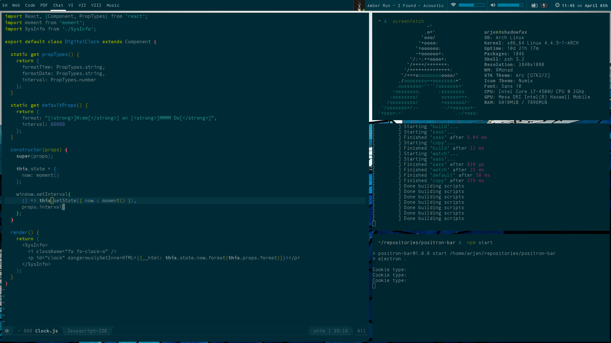

# Positron Bar



## Getting started

This will be streamlined in the near future, but for now:

##### Install the dependencies

```bash
npm install
```

##### ... build the js modules:

```
gulp build
./node_modules/.bin/babel src/main.js -o dist/main.js
```

##### ... and run it:

```
npm start
```

## How it works

The bar is essentially just a browser window (powered by electron.js).
Electron apps consist of 2 processes: the main process which creates the window and the renderer process that runs inside the browser.
We'll focus on the renderer process here, which runs `src/app.js`.

### View Components & the Redux Store

Because we're running a browser, the elements of the view are just html components, styled with CSS.
The html i rendered by [React](https://facebook.github.io/react/index.html).

The components of course need some data to display.
This data is aggregated in a global [redux](http://redux.js.org/docs/introduction/index.html) store.
Every component is accompanied by a function that selects data from that store.
This selection is then injected into the component, which in turn just renders it.
Everytime the store updates, the components update through the magic that is React.

### Filling the Store

To fill the store with data, `src/app.js` runs "providers" in an interval.
These providers just gather some data and then fire some receive-action.
These actions are picked up by so-called "reducers", which update the store.
This design is the react-redux way of doing things and you can read more about it in their docs.

